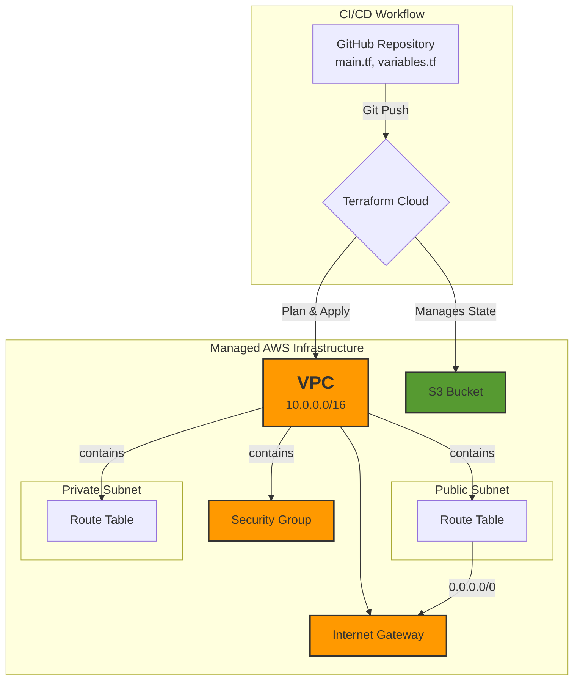

# johnuja-aws-infra-proj

A foundational Terraform project for provisioning a secure, cost-effective, and professional AWS infrastructure. This project demonstrates Infrastructure as Code (IaC) best practices using a GitOps workflow with Terraform Cloud.

## Project Overview

This repository contains the Terraform code to build a foundational network and storage infrastructure in AWS. It is designed to be a reusable and easily understandable starting point for more complex applications. The entire lifecycle of the infrastructure is managed through a CI/CD pipeline orchestrated by Terraform Cloud, triggered by commits to this GitHub repository.

## Architecture Diagram

The following diagram illustrates the provisioned resources and the CI/CD workflow:

## Live Pipeline Verification

The following images from the Terraform Cloud workspace serve as proof that the infrastructure described above was successfully deployed and is being actively managed through the CI/CD pipeline.

### Successful Plan & Apply

*This screenshot shows the successful completion of a run triggered by a `git push` to the `main` branch, demonstrating a working GitOps pipeline.*

**(run.png)**

### Managed Resources

*This screenshot lists the 13 infrastructure resources being managed by Terraform Cloud, confirming its control over the live AWS environment.*

**(Resources.png)**

## Core Infrastructure Components

-   **VPC:** A logically isolated virtual network (`10.0.0.0/16`) to house all resources.
-   **Subnets:**
    -   A **Public Subnet** with a route to the Internet Gateway, suitable for public-facing resources like load balancers.
    -   A **Private Subnet** with no direct internet access, suitable for backend services and databases.
-   **Internet Gateway:** Provides the VPC with access to the internet.
-   **Route Tables:** Control the flow of traffic within the VPC.
-   **S3 Bucket:** A private S3 bucket for general-purpose object storage.
-   **Security Group:** A basic outbound security group allowing all egress traffic.

## How It Works

1.  **Code:** All infrastructure is defined in `.tf` files in this repository.
2.  **Commit & Push:** Any change to the Terraform code is committed and pushed to the `main` branch on GitHub.
3.  **Trigger:** A webhook notifies Terraform Cloud of the new commit.
4.  **Plan:** Terraform Cloud automatically runs a `terraform plan` to determine the necessary changes.
5.  **Apply:** After manual approval in the Terraform Cloud UI, the changes are applied to the AWS account.

## Next Steps

This foundational project is now complete. You can view the live, managed state of this infrastructure in your Terraform Cloud workspace. From here, you could:

-   Add EC2 instances, RDS databases, or load balancers that use this network foundation.
-   Create a new branch in this repository to experiment with changes, seeing the proposed plan in Terraform Cloud before merging.
-   Showcase this repository and your Terraform Cloud workspace to demonstrate your cloud and DevOps skills. 
